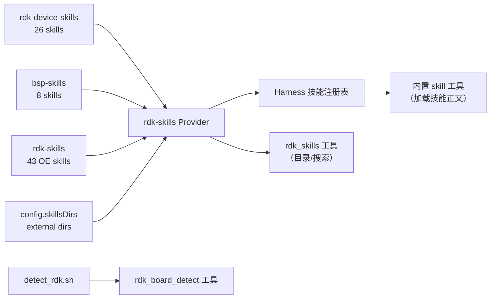

<p align="center">
  
</p>

<p align="center">
  <a href="https://github.com/D-Robotics/dsh-plugin-rdk/stargazers"></a>
  <a href="https://github.com/D-Robotics/dsh-plugin-rdk/actions/workflows/test.yml"></a>
  <a href="./LICENSE"></a>
  <a href="https://github.com/topics/dsh-plugin"></a>
</p>

<p align="center">
  <b>D-Robotics RDK（地瓜机器人）的 DeepSeek Harness 原生适配插件</b><br/>
  装上它，你的 DSH 会话就「懂」RDK 了 —— 77 个官方技能开箱即用。
  <br/><br/>
  <a href="README.zh.md">📖 中文文档</a> ·
  <a href="#-quick-start">🚀 快速开始</a> ·
  <a href="#-tools">🛠 工具</a> ·
  <a href="#-configuration">⚙️ 配置</a> ·
  <a href="https://github.com/topics/dsh-plugin">🌐 dsh-plugin 生态</a>
</p>

---

## ✨ 能做什么

| | 能力 | 说明 |
| --- | --- | --- |
| 🧠 | **原生技能目录** | 把 3 个官方技能包（77 个技能）注册进 harness 技能注册表 —— 它们会出现在会话技能目录里，模型用内置 `skill` 工具即可随时加载完整操作指南 |
| 🔎 | **`rdk_skills` 工具** | 给模型的目录工具：全量列表 / 关键词搜索 / 精确技能详情（路径、脚本、标签） |
| 🛰 | **`rdk_board_detect` 工具** | 运行官方 `detect_rdk.sh`，判断当前主机是不是 RDK 板卡（型号 / SoC / BPU 架构 / 内存 / 系统版本） |
| 📦 | **离线即用** | 技能内容随 npm 包分发，装完就能用，不依赖网络 |
| 🔄 | **自动同步** | 每周 GitHub Action 检查上游技能包变化并自动开 PR；新增技能包**零代码改动**（`skills/` 下每个目录自动被当作技能包扫描） |
| 🎛 | **可配置** | 外部技能目录（覆盖内置）、OE 工具链开关、自定义检测脚本 |

## 🚀 快速开始

```bash
# 从 npm 安装（发布后）
dsh plugin --profile rdk add dsh-plugin-rdk

# 或从 GitHub 直接安装
dsh plugin --profile rdk add github:D-Robotics/dsh-plugin-rdk

# 启动
dsh --profile rdk
```

装好之后直接对话：

```text
You: 有哪些 RDK 技能可以用？
AI:  (调用 rdk_skills) 当前索引了 77 个技能 ——
     26 个设备技能（诊断/摄像头/模型部署/GPIO/TROS…）、
     8 个 BSP 技能（镜像/内核/uboot/rootfs 构建…）、
     43 个 OE 工具链技能（X5 PTQ/QAT、S 系列 UCP/HBDK…）。

You: 诊断一下我的 X5 板为什么发烫
AI:  (加载 rdk-diagnostic 技能) 我来跑一下 snapshot.sh 采集温度、BPU 占用和内存快照…

You: 这台机器是 RDK 板吗？
AI:  (调用 rdk_board_detect) 是的：rdk-x5 / sunrise-5 / bayes-e / 4GB。
```

## 🧩 内置技能包

| 包 | 技能数 | 内容 | 上游仓库 |
| --- | --- | --- | --- |
| `rdk-device-skills` | 26 | 板端诊断、内存审计、摄像头、模型部署/评测、GPIO、40PIN、TROS、无头模式、日志取证、网络远程、外设、LLM 部署、具身智能… | [D-Robotics/rdk-device-skills](https://github.com/D-Robotics/rdk-device-skills) |
| `bsp-skills` | 8 | host 侧 BSP 开发：交叉编译环境、repo 源码同步、系统镜像、内核/DTB/驱动、deb 包、bootloader/miniboot、rootfs 定制、S 系列源码 | [D-Robotics/bsp-skills](https://github.com/D-Robotics/bsp-skills) |
| `rdk-skills`（OE Hub） | 43 | X5 OE Mapper PTQ/QAT、S 系列 HBDK/UCP/Perfetto、板端性能与精度评估、模型编译部署 | [D-Robotics/rdk-skills](https://github.com/D-Robotics/rdk-skills) |

> 技能按名字去重：设备包优先，外部配置目录覆盖内置。总数 77（截至最近一次同步，见 `skills/manifest.json`）。

## 🔧 工作原理



- **Provider 懒加载**：注册表只拿名字和描述做路由；技能正文在模型真正加载时才从磁盘读取；
- **不重复造轮子**：目录/搜索走原生注册表，板端命令执行交给 DSH 自带 bash/pwsh 工具；
- **失败不编造**：检测脚本在非 RDK 主机上返回 `{ detected: false, reason }`。

## 🛠 工具

### `rdk_skills` — 技能目录

| 参数 | 说明 |
| --- | --- |
| `query`（可选） | 精确技能名返回详情（路径 + 脚本清单）；关键词则按名称/描述/标签搜索 |
| `refresh`（可选） | 强制重新扫描配置的目录（默认用缓存索引） |

```text
rdk_skills { query: "diagnostic" }
→ matched: 7 / total: 77
  rdk-diagnostic, rdk-log-forensics, rdk-docs-reference,
  x5-accuracy-diagnostics, x5-consistency-diagnostics,
  x5-model-diagnostics, x5-performance-diagnostics
```

### `rdk_board_detect` — 板卡检测

```text
rdk_board_detect {}
→ { "detected": true, "board": "rdk-x5", "soc": "sunrise-5",
    "bpuArch": "bayes-e", "memGb": 4, "osVersion": "3.0.0", … }
  # 非 RDK 主机：
→ { "detected": false, "reason": "not-an-rdk-host: …" }
```

## ⚙️ 配置

在 profile 的 `cordis.patch.yml`（或 bundle 行）里覆盖默认值：

```yaml
- insert:
    - id: rdk-skills
      name: dsh-plugin-rdk
      config:
        skillsDirs: []        # 额外技能目录，先于内置包扫描（同名覆盖内置）
        includeOe: true       # 是否包含 OE / X5 / S 工具链技能
        detectScript: null    # 自定义板卡检测脚本（默认用内置 detect_rdk.sh）
```

| 字段 | 类型 | 默认 | 含义 |
| --- | --- | --- | --- |
| `skillsDirs` | `string[]` | `[]` | 存放 `SKILL.md` 技能目录的外部目录列表 |
| `includeOe` | `boolean` | `true` | `false` 时去掉 `rdk-skills` Hub 里的 OE/X5/S 技能（设备 + BSP 保留） |
| `detectScript` | `string` | 内置脚本 | `rdk_board_detect` 执行的检测脚本 |

## 🔄 保持技能最新

内置技能是普通文件副本，插件**离线可用**。要跟上上游变化：

```bash
npm run sync    # 默认从本地 checkout 同步
```

或通过环境变量指定来源（路径或 git URL）：

```bash
RDK_DEVICE_SKILLS_SOURCE=https://github.com/D-Robotics/rdk-device-skills.git \
RDK_SKILLS_SOURCE=https://github.com/D-Robotics/rdk-skills.git \
BSP_SKILLS_SOURCE=https://github.com/D-Robotics/bsp-skills.git \
npm run sync
```

仓库里的 GitHub Action 每周自动同步并开 PR；同步记录（来源 + commit）在 `skills/manifest.json`。

## 🧪 开发

```bash
npm install
npm run build   # tsc → dist/
npm test        # 构建 + 11 个单测
npm run sync    # 刷新内置技能
```

目录结构：

```text
dsh-plugin-rdk/
├── cordis.patch.yml       # bundle 补丁层（插件行）
├── src/                   # 插件源码：provider / 工具 / frontmatter / 检测
├── skills/                # vendored 技能包（sync 产物）
├── scripts/sync-skills.mjs
└── .github/workflows/     # 测试 + 每周技能同步
```

## 📄 许可证

- 插件代码：**Apache-2.0**（见 [LICENSE](LICENSE)）
- 内置技能内容：**Apache-2.0 AND CC-BY-4.0**，版权归 D-Robotics（见 [NOTICE.md](NOTICE.md) 及各包的 `LICENSE*`）
- 本项目不是 D-Robotics 官方产品。

## 🔗 生态链接

- 🧭 [D-Robotics/rdk-skills](https://github.com/D-Robotics/rdk-skills) —— 官方技能 Hub（含 [`.dsh-plugin/marketplace.json`](https://github.com/D-Robotics/rdk-skills/blob/main/.dsh-plugin/marketplace.json) 入口）
- 🌐 [GitHub topic: dsh-plugin](https://github.com/topics/dsh-plugin)
- 🧰 [DeepSeek Harness 插件开发文档](https://github.com/deepseek-ai/deepseek-harness/blob/master/docs/user/develop/basic/publish.md)
