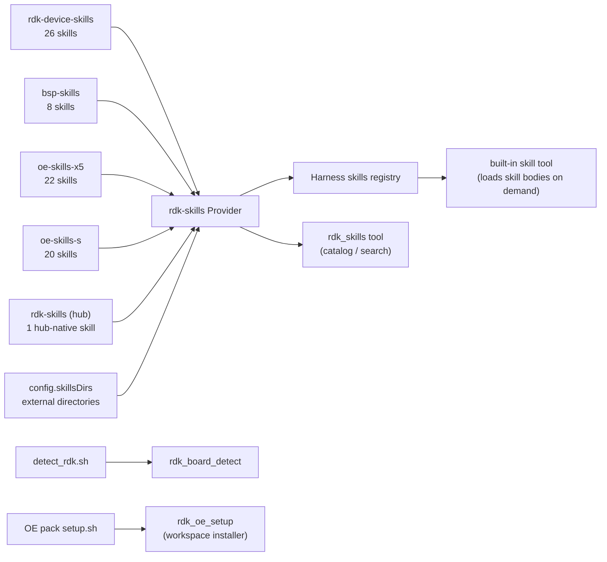

<p align="center">
  
</p>

<p align="center">
  <a href="https://github.com/D-Robotics/dsh-plugin-rdk/stargazers"></a>
  <a href="https://github.com/D-Robotics/dsh-plugin-rdk/actions/workflows/test.yml"></a>
  <a href="./LICENSE"></a>
  <a href="https://github.com/topics/dsh-plugin"></a>
</p>

<p align="center">
  <strong>D-Robotics RDK &middot; DeepSeek Harness</strong><br/>
  <sub>Native skill catalog, catalog tools, and workspace integration for the RDK ecosystem.<br/>
  <a href="README.zh.md">中文文档</a> &middot;
  <a href="#installation">Installation</a> &middot;
  <a href="#tools">Tools</a> &middot;
  <a href="#configuration">Configuration</a> &middot;
  <a href="https://github.com/topics/dsh-plugin">dsh-plugin ecosystem</a></sub>
</p>

---

## Overview

`dsh-plugin-rdk` is a [DeepSeek Harness bundle plugin](https://github.com/deepseek-ai/deepseek-harness/blob/master/docs/user/develop/basic/publish.md) that adapts the D-Robotics RDK skill ecosystem into the harness natively. It registers five vendored skill packs into the harness skills registry, provides model-facing tools for browsing the catalog and detecting RDK hardware, and can install the OpenExplorer (OE) toolchain packs into a project workspace with the same `setup.sh` flow as the official repositories.

The five skill packs (see `skills/manifest.json` for the exact source and commit of each):

| Pack | Count | Contents |
| --- | --- | --- |
| `rdk-device-skills` | 26 | Board diagnostics, camera, model deployment, GPIO, TROS, headless, memory audit, log forensics, LLM, embodied AI, and more |
| `bsp-skills` | 8 | Host-side BSP development: cross-compilation, repo sync, kernel/DTB/driver builds, deb packaging, bootloader, rootfs customization |
| `oe-skills-x5` | 22 | X5 OE Mapper quantization (PTQ/QAT), compilation, runtime inference, performance and accuracy diagnostics |
| `oe-skills-s` | 20 | S-series HBDK compilation, UCP inference, Perfetto trace analysis, plugin chain debugging, precision tuning |
| `rdk-skills` (hub) | 1 | The `d-robotics-pack-installer` hub-native skill; its mirrors of the other packs are skipped in favour of the dedicated sources |

Duplicate names are resolved by scan order: device pack first, then BSP, then the dedicated OE packs, and the hub last. External directories configured in `skillsDirs` are scanned before everything and win every conflict.

## Installation

```bash
# from the npm registry (once published)
dsh plugin --profile rdk add dsh-plugin-rdk

# or directly from this repository (works before an npm release exists)
dsh plugin --profile rdk add github:D-Robotics/dsh-plugin-rdk

# or from a local checkout
dsh plugin --profile rdk add file:/path/to/dsh-plugin-rdk

dsh --profile rdk
```

Once installed, an agent can ask for any RDK capability directly:

```text
> 有哪些 RDK 技能可以用？
  (rdk_skills)  77 skills across 5 packs. 26 device, 8 BSP, 22 X5, 20 S-series, 1 hub.

> 诊断一下 X5 板为什么发烫
  (loads rdk-diagnostic)  Running snapshot.sh — CPU 46°C, BPU 48°C, BPU core 0 at 37%...

> 这台机器是 RDK 板吗？
  (rdk_board_detect)  Yes: rdk-x5 / sunrise-5 / bayes-e / 4 GB.
```

## Architecture



- **Lazy loading**: the registry only holds names and descriptions for routing; skill bodies are read from disk when the model actually loads a skill.
- **No fabrication**: device detection returns `{ detected: false, reason }` on non-RDK hosts.

## Tools

### `rdk_skills`

| Parameter | Type | Description |
| --- | --- | --- |
| `query` | string (optional) | Exact skill name returns detail (path, scripts, tags); a keyword searches names, descriptions, and tags. |
| `refresh` | bool (optional) | Force a rescan of the configured directories (defaults to the cached index). |

```text
rdk_skills { query: "diagnostic" }
matched: 7 / total: 77
rdk-diagnostic, rdk-log-forensics, rdk-docs-reference,
x5-accuracy-diagnostics, x5-consistency-diagnostics,
x5-model-diagnostics, x5-performance-diagnostics
```

### `rdk_board_detect`

```text
rdk_board_detect {}
→ { detected: true, board: "rdk-x5", soc: "sunrise-5",
    bpuArch: "bayes-e", memGb: 4, osVersion: "3.0.0" }
  # on a non-RDK host:
→ { detected: false, reason: "not-an-rdk-host: ..." }
```

### `rdk_oe_setup`

| Parameter | Type | Description |
| --- | --- | --- |
| `pack` | string | `oe-skills-x5` or `oe-skills-s` |
| `projectRoot` | string | Absolute path of the project workspace to initialize. |
| `source` | string (optional) | Git URL or local checkout path; defaults to the official repository. |

This tool runs the **same `setup.sh`** as the upstream repos. For `oe-skills-x5` it lays down `.drobotics/` and injects the `# X5 Workspace Rules` routing block into the workspace `CLAUDE.md` (which DeepSeek Harness reads). For `oe-skills-s` it lays down `.horizon/` with the Horizon routing rules. The result is identical to a manual `git clone` + `bash setup.sh`.

```text
rdk_oe_setup { pack: "oe-skills-x5", projectRoot: "/home/user/my-project" }
→ { ok: true, exitCode: 0, verified: { workspaceDir: ".drobotics",
    version: "3.2.0", skills: 22 } }
```

## Workspace integration (OE packs)

The OE packs (`oe-skills-x5` and `oe-skills-s`) are workspace-integrated: their skills read shared state from `.drobotics/` and `.horizon/` directories that `setup.sh` creates. The plugin supports two modes:

- **Catalog mode** (default): the vendored SKILL.md files are registered as native skills. The agent can read instructions and scripts, but skills that depend on workspace state (environment detection, package installation) will report the missing layout and guide the user through `rdk_oe_setup`.
- **Workspace mode**: run `rdk_oe_setup` once per pack to lay down the full workspace — shared resources, scripts, platform configs, and routing rules. After that the OE skills function exactly as they do in the upstream flow.

Routing works through two independent mechanisms that reinforce each other:

1. The **router skills** (`x5-router`, `horizon-router`) are registered in the harness catalog. When the agent loads them, they follow their internal routing tables (in `references/`) to dispatch to the correct sub-skill.
2. The `setup.sh`-injected **routing rules** in `CLAUDE.md` are picked up by DeepSeek Harness as workspace instructions and take effect for every session of that workspace.

## Configuration

Override defaults in your profile's `cordis.patch.yml`:

```yaml
- insert:
    - id: rdk-skills
      name: dsh-plugin-rdk
      config:
        skillsDirs: []        # extra directories scanned first (win duplicates)
        includeOe: true       # include the oe-skills-x5 / oe-skills-s packs
        detectScript: null    # custom board-detection script
        oeX5Source: null      # custom git URL or local path for oe-skills-x5
        oeSSource: null       # custom git URL or local path for oe-skills-s
```

| Field | Type | Default | |
| --- | --- | --- | --- |
| `skillsDirs` | `string[]` | `[]` | Extra directories of SKILL.md skill folders. |
| `includeOe` | `boolean` | `true` | `false` drops the OE packs and skips their mirrors in the hub. |
| `detectScript` | `string` | &mdash; | Script executed by `rdk_board_detect`. |
| `oeX5Source` | `string` | &mdash; | Custom source for `rdk_oe_setup` when installing `oe-skills-x5`. |
| `oeSSource` | `string` | &mdash; | Custom source for `rdk_oe_setup` when installing `oe-skills-s`. |

## Keeping the catalog current

The vendored packs are plain file copies, so the plugin works offline. To pull in upstream changes:

```bash
npm run sync
```

Set environment variables to override the default sources (path or git URL):

```bash
OE_X5_SKILLS_SOURCE=https://github.com/D-Robotics/oe-skills-x5.git \
OE_S_SKILLS_SOURCE=https://github.com/D-Robotics/oe-skills-s.git \
npm run sync
```

A weekly GitHub Action opens a pull request when the upstream packs change. The sync manifest (`skills/manifest.json`) records the exact source and commit of every pack. Adding a new pack requires no code change: every directory under `skills/` is scanned as a skill pack automatically.

## Development

```bash
npm install
npm run build    # tsc → dist/
npm test         # build + 11 unit tests
npm run sync     # refresh vendored skills
```

```
dsh-plugin-rdk/
├── cordis.patch.yml        # bundle patch layer
├── src/                    # provider / tools / frontmatter / device detection / OE setup
├── skills/                 # vendored skill packs (sync output)
├── scripts/sync-skills.mjs
└── .github/workflows/      # test + weekly sync
```

## License

Plugin code: **Apache-2.0** ([LICENSE](LICENSE)). Vendored skill content: **Apache-2.0 AND CC-BY-4.0**, &copy; D-Robotics. See [NOTICE.md](NOTICE.md) and the per-pack `LICENSE*` files for attribution. This project is not an official D-Robotics product.

## Links

- [D-Robotics/rdk-skills](https://github.com/D-Robotics/rdk-skills) &mdash; official skill hub (includes the [`.dsh-plugin/marketplace.json`](https://github.com/D-Robotics/rdk-skills/blob/main/.dsh-plugin/marketplace.json) entry)
- [GitHub topic: dsh-plugin](https://github.com/topics/dsh-plugin)
- [DeepSeek Harness plugin development docs](https://github.com/deepseek-ai/deepseek-harness/blob/master/docs/user/develop/basic/publish.md)