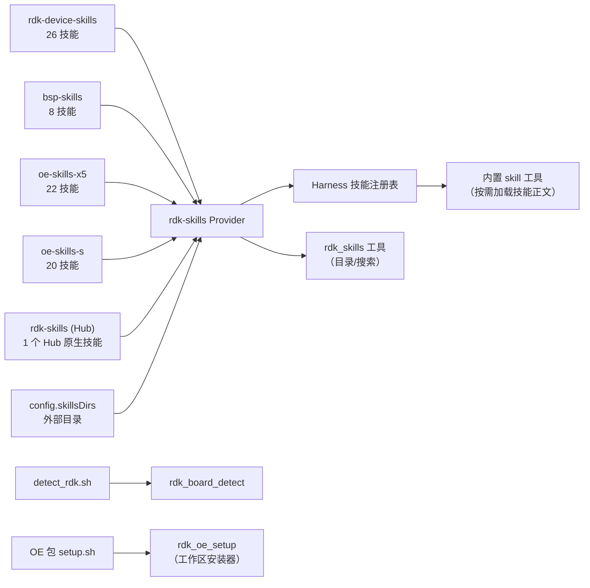

<p align="center">
  
</p>

<p align="center">
  <a href="https://github.com/D-Robotics/dsh-plugin-rdk/stargazers"></a>
  <a href="https://github.com/D-Robotics/dsh-plugin-rdk/actions/workflows/test.yml"></a>
  <a href="./LICENSE"></a>
  <a href="https://github.com/topics/dsh-plugin"></a>
</p>

<p align="center">
  <strong>D-Robotics RDK &middot; DeepSeek Harness</strong><br/>
  <sub>原生技能目录、模型工具、工作区集成的 RDK 生态适配插件。<br/>
  <a href="README.md">English</a> &middot;
  <a href="#安装">安装</a> &middot;
  <a href="#工具">工具</a> &middot;
  <a href="#配置">配置</a> &middot;
  <a href="https://github.com/topics/dsh-plugin">dsh-plugin 生态</a></sub>
</p>

---

## 概述

`dsh-plugin-rdk` 是一个 [DeepSeek Harness bundle 插件](https://github.com/deepseek-ai/deepseek-harness/blob/master/docs/user/develop/basic/publish.md)，将 D-Robotics RDK 技能生态原生接入 harness。它把五个内置技能包注册进 harness 技能注册表，提供浏览目录和检测硬件的模型工具，并且能以与官方仓库完全一致的 `setup.sh` 流程将 OpenExplorer（OE）工具链包安装到项目工作区。

五个技能包（各包的精确来源与 commit 见 `skills/manifest.json`）：

| 包 | 数量 | 内容 |
| --- | --- | --- |
| `rdk-device-skills` | 26 | 板端诊断、摄像头、模型部署、GPIO、TROS、无头模式、内存审计、日志取证、LLM、具身智能等 |
| `bsp-skills` | 8 | Host 侧 BSP 开发：交叉编译、repo 同步、内核/DTB/驱动构建、deb 打包、bootloader、rootfs 定制 |
| `oe-skills-x5` | 22 | X5 OE Mapper 量化（PTQ/QAT）、编译、Runtime 推理、性能与精度诊断 |
| `oe-skills-s` | 20 | S 系列 HBDK 编译、UCP 推理、Perfetto trace 分析、plugin 链调试、精度调优 |
| `rdk-skills`（Hub） | 1 | `d-robotics-pack-installer` 技能；Hub 对其他包的镜像被跳过，由专用源替代 |

去重顺序：设备包 → BSP → 专用 OE 包 → Hub 最后。外部 `skillsDirs` 最先扫描，覆盖所有同名技能。

## 安装

```bash
dsh plugin --profile rdk add dsh-plugin-rdk
dsh --profile rdk
```

装好后直接对话：

```text
> 有哪些 RDK 技能可以用？
  (rdk_skills)  77 个技能，5 个包。26 设备、8 BSP、22 X5、20 S、1 Hub。

> 诊断一下 X5 板为什么发烫
  (加载 rdk-diagnostic)  运行 snapshot.sh —— CPU 46°C, BPU 48°C, BPU core 0 37%...

> 这台机器是 RDK 板吗？
  (rdk_board_detect)  是的：rdk-x5 / sunrise-5 / bayes-e / 4 GB。
```

## 架构



- **懒加载**：注册表仅存名字和描述用于路由；技能正文在模型真正加载时才从磁盘读取。
- **不编造数据**：板卡检测在非 RDK 主机上返回 `{ detected: false, reason }`。

## 工具

### `rdk_skills`

| 参数 | 类型 | 说明 |
| --- | --- | --- |
| `query` | string（可选） | 精确技能名返回详情（路径、脚本、标签）；关键词按名称、描述、标签搜索 |
| `refresh` | bool（可选） | 强制重新扫描配置目录（默认用缓存索引） |

```text
rdk_skills { query: "diagnostic" }
matched: 7 / total: 77
rdk-diagnostic, rdk-log-forensics, rdk-docs-reference,
x5-accuracy-diagnostics, x5-consistency-diagnostics,
x5-model-diagnostics, x5-performance-diagnostics
```

### `rdk_board_detect`

```text
rdk_board_detect {}
→ { detected: true, board: "rdk-x5", soc: "sunrise-5",
    bpuArch: "bayes-e", memGb: 4, osVersion: "3.0.0" }
  # 非 RDK 主机：
→ { detected: false, reason: "not-an-rdk-host: ..." }
```

### `rdk_oe_setup`

| 参数 | 类型 | 说明 |
| --- | --- | --- |
| `pack` | string | `oe-skills-x5` 或 `oe-skills-s` |
| `projectRoot` | string | 要初始化的项目工作区绝对路径 |
| `source` | string（可选） | Git URL 或本地 checkout 路径；默认使用官方仓库 |

此工具运行的是**与上游仓库完全相同的 `setup.sh`**。对于 `oe-skills-x5`，它铺设 `.drobotics/` 并将 `# X5 Workspace Rules` 路由块注入工作区 `CLAUDE.md`（DeepSeek Harness 会读取）。对于 `oe-skills-s`，它铺设 `.horizon/` 并注入 Horizon 路由规则。结果与手动 `git clone` + `bash setup.sh` 完全一致。

```text
rdk_oe_setup { pack: "oe-skills-x5", projectRoot: "/home/user/my-project" }
→ { ok: true, exitCode: 0, verified: { workspaceDir: ".drobotics",
    version: "3.2.0", skills: 22 } }
```

## 工作区集成（OE 包）

OE 包（`oe-skills-x5` 和 `oe-skills-s`）是工作区集成的：它们的技能依赖 `setup.sh` 创建的 `.drobotics/` 和 `.horizon/` 目录中的共享状态。插件支持两种模式：

- **目录模式**（默认）：内置的 SKILL.md 文件注册为原生技能。Agent 可以读取指令和脚本，但依赖工作区状态的技能（环境检测、包安装）会报告缺失，引导用户通过 `rdk_oe_setup` 完成安装。
- **工作区模式**：每个包运行一次 `rdk_oe_setup`，铺设完整工作区——共享资源、脚本、平台配置和路由规则。之后 OE 技能与上游流程完全一致。

路由通过两个互相加强的独立机制工作：

1. **路由技能**（`x5-router`、`horizon-router`）已注册在 harness 目录中。Agent 加载后按内部路由表（`references/` 中）分发到正确的子技能。
2. `setup.sh` 注入的 **路由规则**写入 `CLAUDE.md`，DeepSeek Harness 将其作为工作区指令读取，对该工作区的所有会话生效。

## 配置

在 profile 的 `cordis.patch.yml` 中覆盖默认值：

```yaml
- insert:
    - id: rdk-skills
      name: dsh-plugin-rdk
      config:
        skillsDirs: []        # 额外目录，最先扫描（同名覆盖内置）
        includeOe: true       # 是否包含 oe-skills-x5 / oe-skills-s 包
        detectScript: null    # 自定义板卡检测脚本
        oeX5Source: null      # oe-skills-x5 的自定义安装源
        oeSSource: null       # oe-skills-s 的自定义安装源
```

| 字段 | 类型 | 默认 | |
| --- | --- | --- | --- |
| `skillsDirs` | `string[]` | `[]` | 存放 SKILL.md 技能目录的外部目录列表 |
| `includeOe` | `boolean` | `true` | `false` 时去掉 OE 包及其在 Hub 中的镜像 |
| `detectScript` | `string` | &mdash; | `rdk_board_detect` 执行的检测脚本 |
| `oeX5Source` | `string` | &mdash; | `rdk_oe_setup` 安装 `oe-skills-x5` 时的自定义源 |
| `oeSSource` | `string` | &mdash; | `rdk_oe_setup` 安装 `oe-skills-s` 时的自定义源 |

## 保持技能最新

内置技能是普通文件副本，插件离线可用。要同步上游变化：

```bash
npm run sync
```

通过环境变量覆盖来源（路径或 git URL）：

```bash
OE_X5_SKILLS_SOURCE=https://github.com/D-Robotics/oe-skills-x5.git \
OE_S_SKILLS_SOURCE=https://github.com/D-Robotics/oe-skills-s.git \
npm run sync
```

GitHub Action 每周检查上游变化并自动开 PR。同步记录（`skills/manifest.json`）保存每个包的来源和 commit。新增技能包无需改动代码：`skills/` 下的每个目录自动被当作技能包扫描。

## 开发

```bash
npm install
npm run build    # tsc → dist/
npm test         # 构建 + 11 个单测
npm run sync     # 刷新内置技能
```

```
dsh-plugin-rdk/
├── cordis.patch.yml        # bundle 补丁层
├── src/                    # provider / 工具 / frontmatter / 检测 / OE 安装
├── skills/                 # 内置技能包（sync 产物）
├── scripts/sync-skills.mjs
└── .github/workflows/      # 测试 + 每周同步
```

## 许可证

插件代码：**Apache-2.0**（[LICENSE](LICENSE)）。内置技能内容：**Apache-2.0 AND CC-BY-4.0**，&copy; D-Robotics。详见 [NOTICE.md](NOTICE.md) 及各包的 `LICENSE*` 文件。本项目不是 D-Robotics 官方产品。

## 链接

- [D-Robotics/rdk-skills](https://github.com/D-Robotics/rdk-skills) &mdash; 官方技能 Hub（含 [`.dsh-plugin/marketplace.json`](https://github.com/D-Robotics/rdk-skills/blob/main/.dsh-plugin/marketplace.json) 入口）
- [GitHub topic: dsh-plugin](https://github.com/topics/dsh-plugin)
- [DeepSeek Harness 插件开发文档](https://github.com/deepseek-ai/deepseek-harness/blob/master/docs/user/develop/basic/publish.md)